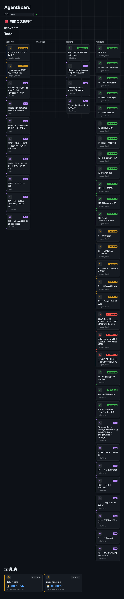

# AgentBoard

在浏览器里统一可视化 **Claude Code / Codex** 项目的 **todo** 和 **定时任务** 的本地看板。

单文件 exe(Bun 编译),伴随 AI 编程会话自启动:开任意 Claude Code / Codex 会话 → 看板自动起、自动收录当前项目、冷启动时自动打开浏览器。todo 直接读项目里的文档(跨工具、持久),定时任务从一个本地 JSON 读取,文件一改看板**实时刷新**。UI 为 bento 卡片 + 网格背景,卡片按来源配色。



## 特性

- **任务源 = 项目文档**(跨工具、持久,无需各工具内部 API):
  - `.claude/RESUME.md` —— 任务进度表(`| Task | Status | Commit |`,状态 ⬜/🔄/⏸️/✅)
  - `TODO.md` —— 复选框列表(`- [ ] / - [x]`)
  - `STATUS.md` —— project-bootstrap 总控台:Phase 账本 + Open items
  - `AI-ISSUES.md` —— 问题表(按 Status 列映射)
  - **Claude Code Task 系统** —— `~/.claude/tasks/<session>/*.json`(当前会话的 TaskCreate/TaskList 任务,`source=Task`;`blockedBy` 非空 → 阻塞列)
- **定时任务可视化**:从 `~/.agentboard/schedule.json` 读取,bento 卡片显示 cron 表达式 + 下次运行时间,并带**每秒倒计时**(到点变红并自动滚到下一周期)。只可视化,不执行。
- **实时刷新**:后端 `fs.watch` + SSE 文件一改自动更新;每次开会话再 `register` 主动戳 `/api/refresh` **确定性广播**(不依赖 Windows 上不可靠的单文件监听);切回看板标签页也会立即重读。
- **多项目**:下拉筛选 / 全部聚合,卡片标注来源文档与所属项目,按来源配色(Task 紫 / RESUME 绿 / TODO 蓝 / STATUS 橙 / AI-ISSUES 红)。
- **会话内实时 todo**:读取项目最近活跃的 Claude Code transcript 的最后一次 TodoWrite,在"🔴 当前会话执行中"细条显示(仅 Claude;Codex rollout 不绑项目且无 plan 数据,暂不支持)。
- **伴随自启动**:Claude Code 与 Codex 的 SessionStart hook 自动注册当前项目并拉起服务;冷启动(服务首次拉起)时自动打开浏览器,后续会话不重复弹标签页。

## 安装

需要 [Bun](https://bun.sh) ≥ 1.3。

```bash
bun install
bun run build          # 产出单文件 agentboard.exe
# 拷到 PATH 上的目录，例如：
cp agentboard.exe "$HOME/.local/bin/agentboard.exe"
```

开发期免编译直接跑:

```bash
bun run dev serve      # = bun run src/index.ts serve
```

## 使用

```bash
agentboard register <项目路径> [--tool claude|codex]   # 注册项目；若服务未起则自动拉起
agentboard serve [--port 8123]                          # 仅启动看板服务
agentboard version
```

启动后打开 **http://127.0.0.1:8123**。

### 伴随会话自启动(可选)

- **Claude Code** —— 在 `~/.claude/settings.json` 的 `SessionStart` 追加一条 hook 调用
  `agentboard register`(项目目录从 hook 的 stdin JSON `cwd` 读取)。
- **Codex** —— 在 `~/.codex/config.toml` 加 `[[hooks.SessionStart]]`(需 `[features] hooks = true`)。
  首次启动 Codex 会要求**信任**该 hook。

仓库内的 `agentboard-start.ps1`(放在 `~/.claude/hooks/`)是 Claude 与 Codex 共用的包装脚本。

### 定时任务

编辑 `~/.agentboard/schedule.json`:

```json
[
  { "name": "daily-report", "cron_expr": "0 9 * * *", "command": "claude -p '...'", "enabled": true, "project": "D:/path/to/proj" }
]
```

## 架构

单文件 Bun/TypeScript exe,四个独立模块:

| 模块 | 职责 |
|---|---|
| `collector/` | 解析项目文档(RESUME/TODO/STATUS/AI-ISSUES)为统一 `Task` 模型 |
| `schedule/` | 读 `schedule.json`,用 `cron-parser` 算下次运行 |
| `server/` | `Bun.serve` REST API + SSE + 内嵌看板静态资源 + 文件监听 |
| `registry/` | 项目登记(`~/.agentboard/projects.json`)、端口探测、脱离启动 |

API:`GET /api/projects` · `/api/tasks?project=` · `/api/schedules?project=`(含 `next_run`) · `/api/live?project=`(会话内 todo) · `/api/stream`(SSE) · `/api/refresh`(广播刷新)。

## 开发

```bash
bun test               # 全部单元/集成测试
bun run build          # 编译单文件 exe
```

设计与计划见 `docs/superpowers/`。

## 不做(明确范围)

- 不执行定时任务(只可视化)
- 不回写任务文档(看板只读)
- 不支持 Codex 会话内 plan(rollout 不绑项目、无 update_plan 数据);Claude 会话内 todo 已支持

## License

MIT
